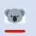

This demo application is meant as a comprehensive implementation of [Taskbar Extensions](https://learn.microsoft.com/en-us/windows/win32/shell/taskbar-extensions) and all the little nuts, bolts a bit of gaffer tape to make all hang together.

Uses MVVM pattern, so most of the logic is contained in the window model view code behind.

The code is a wee bit messy, as it were done as quick as possible. :)

**Tech**
- [Mahapps.Metro](https://github.com/MahApps/MahApps.Metro) - A toolkit for creating awesome WPF applications. Lots of goodness out-of-the box. 
- [MahApps.Metro IconPacks](https://github.com/MahApps/MahApps.Metro.IconPacks) - Awesome icon packs for WPF and UWP in one library

### Taskbar Buttons

### Taskbar context menu - Jump lists
- Recent list with support for pinning items
- Tasks items
- Custom icons (As seen on the task list).
- Execution of actions by calling CommandRelay (console) with commands given as args. CommandRelay will send a message (IPC) back to the demo application that will invoke the command. 

### Taskbar status indicator
- Show an icon overlay on top of the app icon
- Will render the icon from XAML dynamically from code behind

### Taskbar progress indicator
Makes it possible to animate the bar below the app icon to give an impression that something is in progress.

